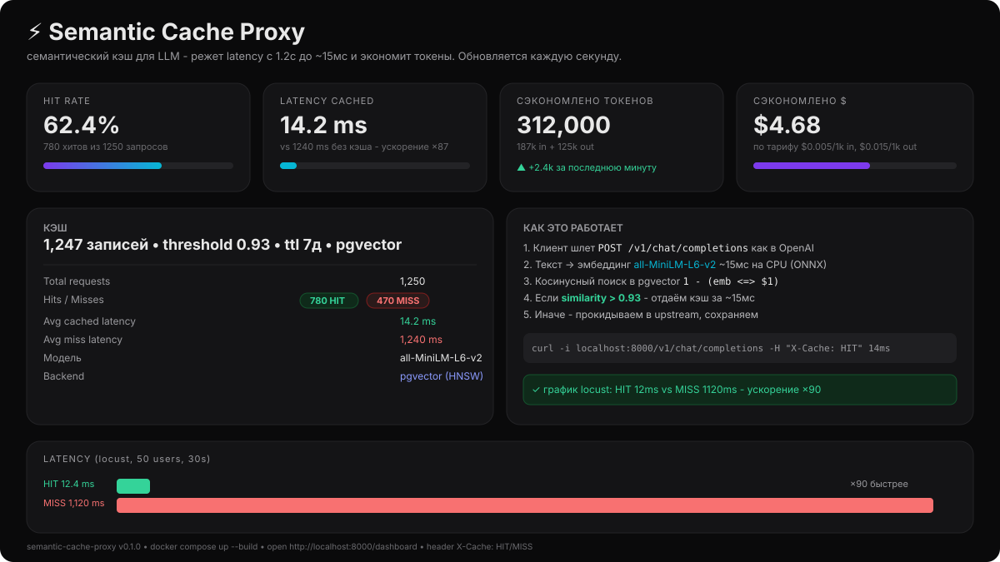

# semantic cache proxy

lightweight proxy between your code and any LLM. paying for every api call and waiting 1-2 sec each time is annoying, so i built this thing that turns your request into an embedding, looks for a similar one in the db by cosine distance and returns the cached answer in 15ms.

built for my portfolio, spent a couple weeks in the evenings. feedback and PRs welcome.


---

## why

two pains with LLM in prod:

1. money - every request costs tokens. "hello how are you" and "hi how are you doing?" cost the same even though the answer is the same
2. latency - 1-2 sec for every request, even if you already asked it 100 times

proxy fixes both: if `similarity > 0.93` - return cache in milliseconds and count how much money you saved.

good for:
- showing you can do infra, not just call openai
- nice portfolio project with graphs
- saving tokens in your own project

---

## how it works

```
Client -> POST /v1/chat/completions -> [ Proxy ]
                                            |
                                 1. text -> embedding      all-MiniLM-L6-v2, about 15ms on cpu
                                 2. cosine search          pgvector / memory
                                 3. similarity > 0.93?  - yes -> return cache (15ms) + X-Cache: HIT
                                                        - no  -> go to LLM, save, return
```

- openai compatible api - just change base_url to http://localhost:8000/v1
- semantic, not exact match. "what is fastapi" and "tell me about fastapi framework" hit the same cache
- expired entries go away by TTL, if cache is full it cleans the oldest

---

## stack

- backend: FastAPI, async
- vectors: postgres + pgvector (or just memory with numpy if you dont want db)
- embeddings: sentence-transformers all-MiniLM-L6-v2, optional onnx, fallback to hash if model not found
- proxy: httpx
- other: docker, pytest, locust

nothing fancy, just glued together what works.

---

## quick start

```bash
cp .env.example .env
# put UPSTREAM_API_KEY if you want real requests, without it you get mock

docker compose up --build
# or make up
```

check:

```bash
curl http://localhost:8000/health
# dashboard
open http://localhost:8000/dashboard
# swagger
open http://localhost:8000/docs

# test proxy
curl -X POST http://localhost:8000/v1/chat/completions \
  -H "Content-Type: application/json" \
  -d '{"model": "gpt-4o-mini", "messages": [{"role": "user", "content": "hello how are you"}]}' -i
# first time X-Cache: MISS, second time HIT
```

without docker:

```bash
pip install -r requirements.txt
uvicorn app.main:app --reload
```

---

## config

everything via .env:

```ini
UPSTREAM_API_URL=https://api.openai.com/v1/chat/completions
UPSTREAM_API_KEY=sk-xxxx
SIMILARITY_THRESHOLD=0.93   # 0.90 more hits, 0.95 stricter
CACHE_TTL_SECONDS=604800    # 7 days
MAX_CACHE_SIZE=10000
VECTOR_BACKEND=memory       # memory, pgvector, redis
EMBEDDING_MODEL=all-MiniLM-L6-v2
USE_ONNX=false
```

want pgvector - just `docker compose up --build`, its already set up. want without postgres - `docker compose -f docker-compose.memory.yml up --build`

---

## api

### POST /v1/chat/completions

normal openai request, supports stream (streams go past cache for now).

```bash
curl -X POST http://localhost:8000/v1/chat/completions \
  -H "Content-Type: application/json" \
  -d '{"model": "gpt-4o-mini", "messages": [{"role": "user", "content": "what is fastapi?"}]}'
```

check headers:
- X-Cache: HIT + X-Cache-Similarity: 0.97 - from cache, 15ms
- X-Cache: MISS - went to upstream
- X-Cache: BYPASS - stream

also `_cache_hit` and `_cache_similarity` in body for debug.

also `POST /v1/completions`, `GET /stats`, `GET /health`, `POST /cache/clear`, `GET /dashboard`.

example `/stats`:

```json
{
  "total_requests": 1250,
  "hits": 780,
  "hit_rate_percent": 62.4,
  "avg_latency_cached_ms": 14.2,
  "avg_latency_miss_ms": 1240.5,
  "money_saved_usd": 4.68
}
```

---

## dashboard

http://localhost:8000/dashboard - hits, latency, how many tokens and dollars you saved. auto refresh.



screenshot generated by script, live looks the same but with your numbers. made quickly, dont judge too hard.

---

## benchmarks

run `make up` then:

```bash
locust -f locustfile.py --host http://localhost:8000 --headless -u 50 -r 10 --run-time 30s
# or simpler
python scripts/benchmark.py --requests 200 --concurrency 10
```

on my laptop with mock upstream:

```
avg          HIT 12.4ms   vs MISS 1120ms   x90 faster
p95          HIT 18ms     vs MISS 1350ms
```

```
HIT  : █ 12.4ms
MISS : ████████████████████████████████████████ 1120ms
```

on real openai difference is even bigger because network + generation.

script saves benchmark_result.json, you can put your own graph in readme.

---

## tests

```bash
pytest -v
# 17 tests, no external deps

make test
```

ci uses `FORCE_DUMMY_EMBEDDING=1` so it doesnt download model. want real model: `FORCE_DUMMY_EMBEDDING=0 pytest -v`

---

## structure

```
app/main.py              - fastapi, endpoints
app/config.py            - settings from .env
app/cache/memory.py      - cache on numpy
app/cache/pgvector.py    - postgres + pgvector, falls back to memory if no db
app/embeddings/local.py  - loads minilm, if fails - hash
app/proxy/upstream.py    - calls llm, without key returns mock
tests/                   - pytest
scripts/benchmark.py     - bench
```

tried to keep it simple, no over engineering.

---

## makefile

```
make up        - start all
make down      - stop
make logs      - logs
make dev       - local without docker
make test      - tests
make benchmark - run bench
make locust    - locust ui
```

---

## whats next

- [x] pgvector works
- [ ] redis version if needed
- [ ] stream cache (now streams bypass)
- [ ] prometheus metrics
- [ ] auth

if you want to help - open an issue.

---

## license

MIT, do what you want.

if you like it - give it a star, makes me happy :)

built with coffee and hate for wasted tokens.
