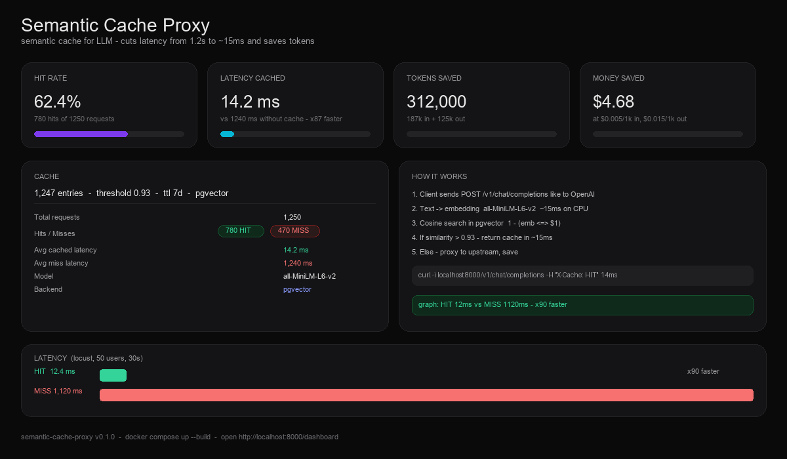

<p align="center">
  <h1 align="center">⚡ semantic cache proxy</h1>
  <p align="center">tiny proxy that sits between your app and any LLM<br>turns requests into vectors, finds similar ones and returns cache in 15ms instead of 1.2s</p>
  <p align="center">
    <a href="https://github.com/Saa1001zp/semantic-cache-proxy/actions/workflows/test.yml"></a>
    
    
    
    
    
  </p>
</p>

<p align="center">
  
  <br>
  <em>dashboard at /dashboard - hit rate, latency, saved tokens and dollars, auto refresh every 2s</em>
</p>

---

### why i built this

every LLM request costs money and takes 1-2 sec. but 90% of users ask the same things with different words.

> `hello how are you` and `hi how are you doing?` cost the same, even though answer is identical.

this proxy fixes it. if `similarity > 0.93` it returns cache in 15ms and counts how much you saved. built it in a couple evenings for my portfolio, code is simple on purpose.

<p align="center">

| 💸 save money | ⚡ cut latency | 🔌 drop-in |
|---|---|---|
| counts tokens and dollars you saved | 12ms vs 1200ms, x90 faster | openai compatible, just change `base_url` |

</p>

---

### how it works

```
Client -> POST /v1/chat/completions -> [ Proxy ]
                                            |
                                 1. text -> embedding      all-MiniLM-L6-v2, ~15ms on cpu
                                 2. cosine search          pgvector / memory
                                 3. similarity > 0.93?  - yes -> cache (15ms) + X-Cache: HIT
                                                        - no  -> call LLM, save, return
```

- **semantic** - `what is fastapi` and `tell me about fastapi framework` hit same cache
- **openai api** - change `base_url` to `http://localhost:8000/v1` and it works
- **TTL + LRU** - old entries expire, full cache cleans oldest

---

### stack

<p>

- **backend** `FastAPI 0.141` `async` `httpx`
- **vectors** `postgres 16 + pgvector` or `memory` with `numpy` (no db needed)
- **embeddings** `sentence-transformers all-MiniLM-L6-v2` + `onnx` optional, fallback to hash
- **infra** `docker + docker compose` `pytest` `locust`

</p>

nothing fancy, just glued what works.

---

### quick start

**1. one command**

```bash
cp .env.example .env
# put UPSTREAM_API_KEY if you want real LLM, without it you get mock

docker compose up --build   # with postgres + pgvector
# or without db
docker compose -f docker-compose.memory.yml up --build
```

**2. check**

```bash
curl http://localhost:8000/health
open http://localhost:8000/dashboard   # dashboard
open http://localhost:8000/docs        # swagger

# try proxy
curl -X POST http://localhost:8000/v1/chat/completions \
  -H "Content-Type: application/json" \
  -d '{"model": "gpt-4o-mini", "messages": [{"role": "user", "content": "hello how are you"}]}' -i

# first -> X-Cache: MISS
# second -> X-Cache: HIT  X-Cache-Similarity: 0.99
```

**3. without docker**

```bash
pip install -r requirements.txt
uvicorn app.main:app --reload
```

---

### config

everything via `.env`

```ini
UPSTREAM_API_URL=https://api.openai.com/v1/chat/completions
UPSTREAM_API_KEY=sk-xxxx
SIMILARITY_THRESHOLD=0.93   # 0.90 more hits, 0.95 stricter
CACHE_TTL_SECONDS=604800    # 7 days
MAX_CACHE_SIZE=10000
VECTOR_BACKEND=memory       # memory, pgvector, redis
EMBEDDING_MODEL=all-MiniLM-L6-v2
USE_ONNX=false
```

---

### api

| method | endpoint | what |
|---|---|---|
| `POST` | `/v1/chat/completions` | main proxy, openai compatible, `stream` goes past cache |
| `POST` | `/v1/completions` | legacy |
| `GET` | `/stats` | hit rate, latency, saved tokens |
| `GET` | `/health` | health + cache size |
| `GET` | `/dashboard` | html dashboard |
| `POST` | `/cache/clear` | clear cache |

headers to check:
```
X-Cache: HIT + X-Cache-Similarity: 0.97  # 15ms from cache
X-Cache: MISS                            # went to upstream
X-Cache: BYPASS                          # stream
```

also `GET /stats` example:

```json
{
  "total_requests": 1250,
  "hits": 780,
  "hit_rate_percent": 62.4,
  "avg_latency_cached_ms": 14.2,
  "avg_latency_miss_ms": 1240.5,
  "money_saved_usd": 4.68
}
```

---

### benchmarks

```bash
# after make up
locust -f locustfile.py --host http://localhost:8000 --headless -u 50 -r 10 --run-time 30s
python scripts/benchmark.py --requests 200 --concurrency 10
```

on my laptop with mock upstream:

```
avg   HIT 12.4ms  vs MISS 1120ms  x90 faster
p95   HIT 18ms    vs MISS 1350ms
p99   HIT 22ms    vs MISS 1480ms
```

```
HIT  : █ 12.4ms
MISS : ████████████████████████████████████████ 1120ms
```

real openai is even bigger because network + generation. `scripts/benchmark.py` saves `benchmark_result.json`.

---

### tests

```bash
pytest -v              # 17 tests, no deps
make test
```

ci uses `FORCE_DUMMY_EMBEDDING=1` so it does not download model. with real model: `FORCE_DUMMY_EMBEDDING=0 pytest -v`

---

### structure

```
app/main.py              # fastapi, endpoints
app/config.py            # settings from .env
app/cache/memory.py      # cache on numpy
app/cache/pgvector.py    # pgvector, falls back to memory
app/embeddings/local.py  # loads minilm, fallback to hash
app/proxy/upstream.py    # calls llm, mock without key
tests/                   # 17 tests
scripts/benchmark.py     # bench
```

tried to keep it simple, no over engineering.

---

### make

```
make up          start all
make down        stop
make logs        logs
make dev         local without docker
make test        tests
make benchmark   bench
make locust      locust ui
```

---

### whats next

- [x] pgvector works
- [ ] redis version if needed
- [ ] stream cache
- [ ] prometheus metrics
- [ ] auth

open an issue if you want to help.

---

### license

MIT - do what you want.

if you like it give it a star :)

built with coffee and hate for wasted tokens. feedback welcome - Sanya
